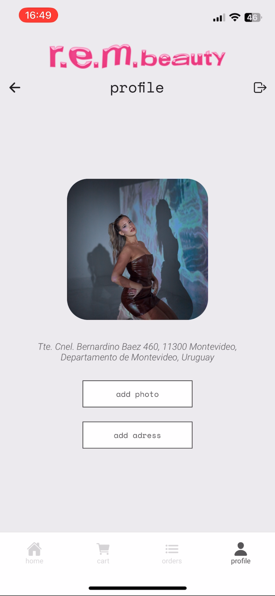
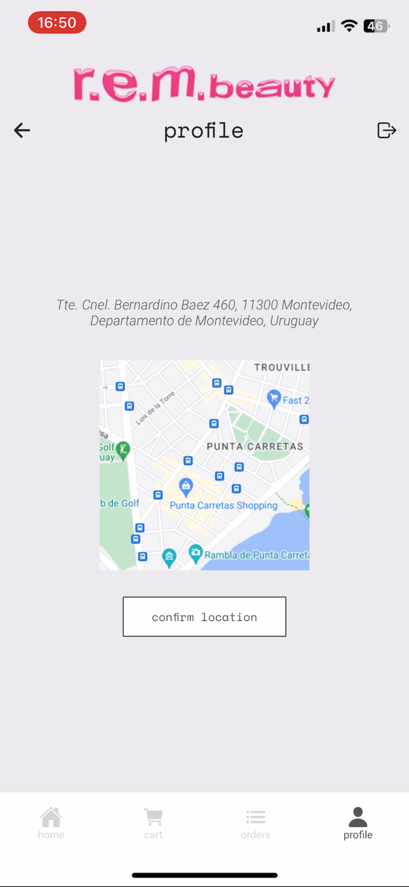
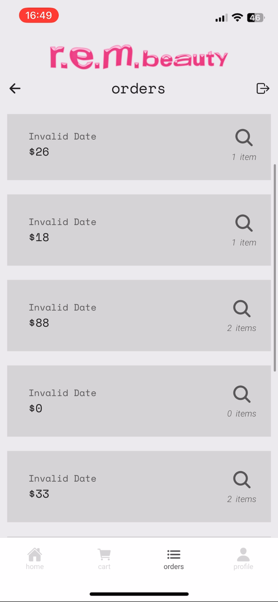
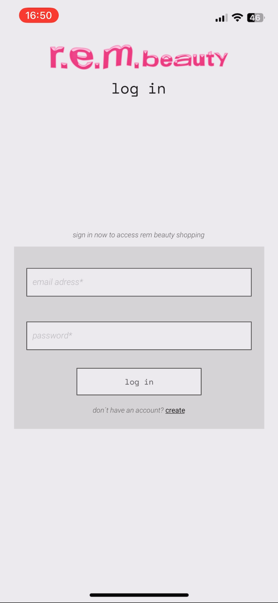
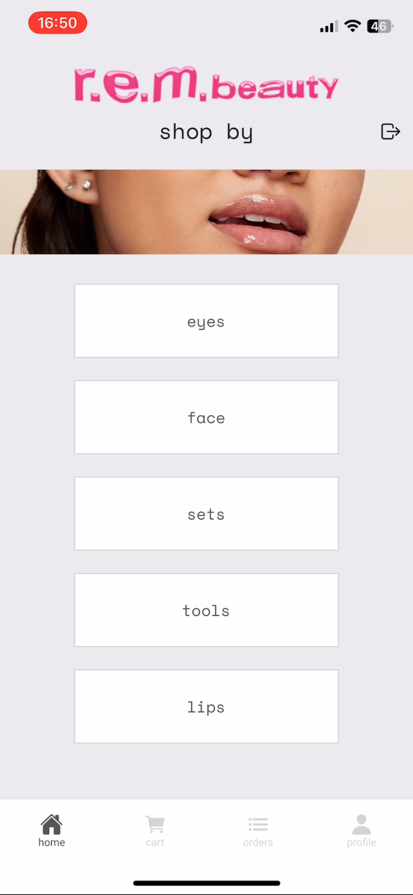
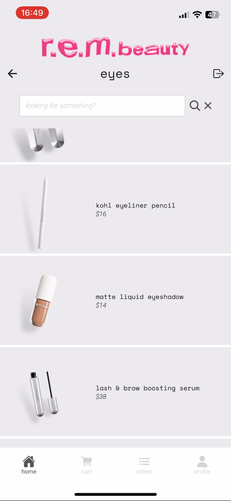
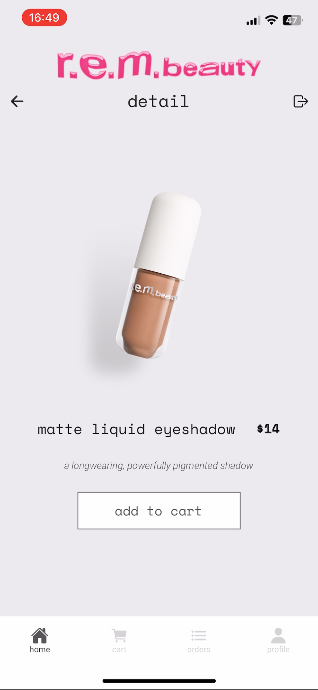
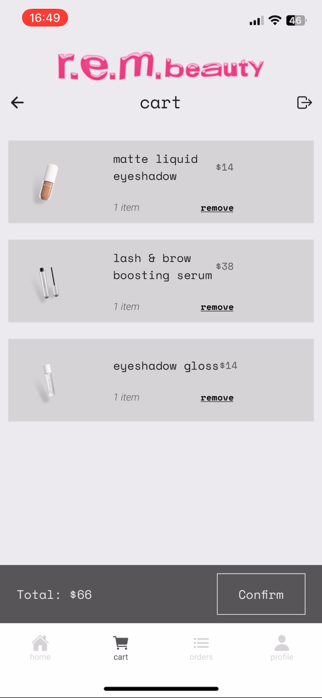

# rem beauty App - React Native

Navegar y comprar es muy fácil, con una experiencia fluida y sin complicaciones. ¡Todo lo que necesitas para una experiencia de compra perfecta!

## Funcionalidades Principales

### Pantalla de Cuenta

- **Acceso seguro:** Los usuarios autenticados pueden acceder a la pantalla de perfil. Para realizar compras y tener un registro de ordenes creadas es necesario loguearse.
- **Información del usuario:** Muestra detalles del usuario. Se puede subir o sacar una foto y agregarla al perfil. También tiene la funcionalidad de geolocalización que en un futuro mostrará cuál es la tienda más cercana a ti.

### Autenticación con Firebase

- Utiliza el sistema de autenticación de Firebase para gestionar el acceso de usuarios.
- Permite a los usuarios iniciar sesión y registrarse de manera segura.

### Pantalla de Categorías

- Muestra una selección de categorías en tarjetas.
- Al hacer clic en una categoría, se navega a la pantalla de productos correspondiente.

### Pantalla de Productos

- Lista todos los productos en tarjetas con nombre, foto y precio.
- Incluye un buscador para filtrar productos por nombre.
- Al hacer clic en un producto, se navega a la pantalla de detalles del producto.

### Pantalla de Detalles del Producto

- Proporciona una descripción detallada del producto.
- Muestra el precio.
- Permite agregar el producto al carrito.

### Pantalla de Carrito

- Muestra los items agregados al carrito
- Se pueden eliminar items del carrito
- Se muestra una suma del total

## Tecnologías Utilizadas

- **Firebase Authentication:** Implementa el sistema de autenticación de Firebase para gestionar la seguridad de la aplicación.
- **React Native Navigation Stack:** Gestiona la navegación entre pantallas.
- **React Native Navigation Buttom tap:** Gestiona la navegación entre pestañas.
- **Expo-Location:** Permite acceder y gestionar la ubicación del usuario.
- **Expo-Picker-Image:** Facilita la carga de imágenes de perfil.
- **Redux:** Centraliza y gestiona el estado de la aplicación.
- **RTK Query y Firebase:** Realiza operaciones de lectura/escritura en la base de datos.

## Instalación

1. Clona el repositorio: `git clone https://github.com/lucilaparodi/rem.git`
2. Instala las dependencias: `npm install`
3. Configura las claves de API para servicios externos (Expo-Location, Firebase, etc.).
4. Configura las credenciales de Firebase en tu proyecto.
5. Ejecuta la aplicación: `npm start`

## Contacto

Para preguntas o soporte, contacta a lucila.parodi.c@gmail.com.
